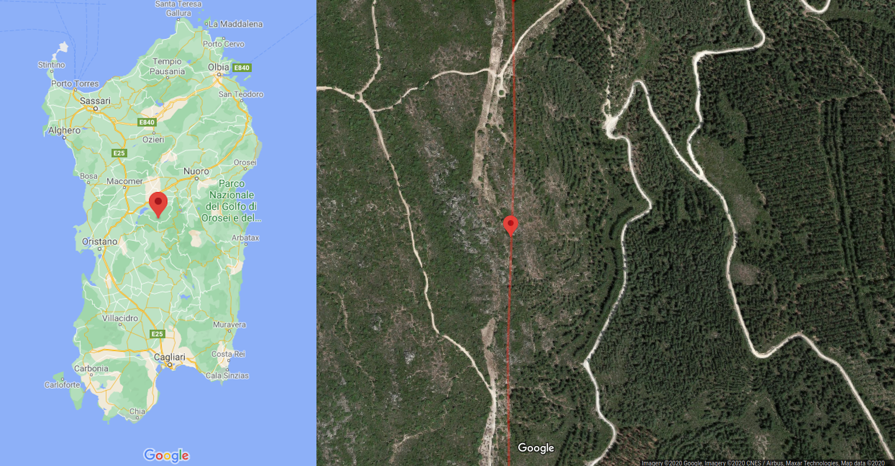

# "Baricentro" della Sardegna

([English version here](README_eng.md))

Un candidato a "baricentro" della Sardegna (`script1_GEOSGetCentroid.py`)  
Situato nel [comune di Neoneli](https://it.wikipedia.org/wiki/Neoneli) ([provincia di Oristano](https://it.wikipedia.org/wiki/Provincia_di_Oristano)), quasi al confine con il [comune di Austis](https://it.wikipedia.org/wiki/Austis) ([provincia di Nuoro](https://it.wikipedia.org/wiki/Provincia_di_Nuoro)), molto vicino al [monumento naturale di Sa Crabarissa](https://www.sardegnainblog.it/5296/sa-crabarissa-austis-foto-leggenda/)

### Overview

Obiettivo di questa analisi è localizzare un possibile "baricentro" della Sardegna, testando diversi metodi e confrontando i risultati

**Disclaimer #1**:

* Solamente la Sardegna continentale è presa in considerazione, le isole sono ignorate. L'obiettivo finale è trovare il punto su cui poter bilanciare l'entroterra della Sardegna su di ~~una spilla sarda~~ uno spillo
* Calcolato in 2D: i rilievi sono ignorati ed il calcolo è effettuato esclusivamente sul poligono delimitato dalla linea costiera

### Checklist

- [x] Localizzare il "baricentro" della Sardegna continentale con almeno un metodo
- [ ] Confrontare i risultati ed eventualmente effettuare analisi sull'accuratezza
- [ ] Visitare il punto o i possibili candidati

### Risultati

##### `script1_GEOSGetCentroid.py`

**[Script](script1_GEOSGetCentroid.py)**

**Origine dati**  
Sardegna Geoportale, **[PPR06 - Linea di costa](http://webgis2.regione.sardegna.it/catalogodati/card.jsp?uuid=R_SARDEG:QRHAF)**

**Algoritmo per il calcolo del centroide**  
`geos::algorithm::Centroid`, vedere [GEOS doxygen](https://geos.osgeo.org/doxygen/classgeos_1_1algorithm_1_1Centroid.html)

**Posizione del centroide**  
Latitudine <u>9.035341385985763</u>, Longitudine <u>40.085501904848066</u>  
[Punto su Google Maps](https://www.google.com/maps/search/?api=1&query=40.085501904848066,9.035341385985763)  
[Punto su OpenStreetMaps](http://www.openstreetmap.org/?mlat=40.085501904848066&mlon=9.035341385985763&zoom=15)