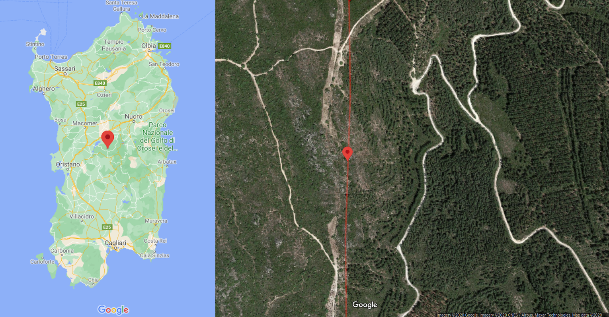

# Sardinia "centroid/barycenter"

A possible candidate for Sardinia "centroid" (`script1_GEOSGetCentroid.py`)  
Located in the [comune of Neoneli](https://en.wikipedia.org/wiki/Neoneli) ([province of Oristano](https://en.wikipedia.org/wiki/Province_of_Oristano)), almost on the border with the [comune of Austis](https://en.wikipedia.org/wiki/Austis) ([province of Nuoro](https://en.wikipedia.org/wiki/Province_of_Nuoro)), nearby a natural monument ([monumento naturale di Sa Crabarissa](https://www.sardegnainblog.it/5296/sa-crabarissa-austis-foto-leggenda/))

### Overview

Objective of this analysis is locate the "centroid" of Sardinia, using different methods and comparing results

**Disclaimer #1**:

* Only Sardinia mainland is considered, islands are ignored. The final objective is to find a point on which balance the entire mainland on a needle
* Computed in 2D: mountains, landforms and water features are ignored and the computation is done only using the polyline determined by the coast

### Checklist

- [x] Locate the point using at least one method
- [ ] Compare results and do an accuracy analysis
- [ ] Travel and visit the point or the candidates

### Results

##### `script1_GEOSGetCentroid.py`

**[Script](script1_GEOSGetCentroid.py)**

**Data source**  
Sardegna Geoportale, **[PPR06 - Linea di costa](http://webgis2.regione.sardegna.it/catalogodati/card.jsp?uuid=R_SARDEG:QRHAF)**

**Algorithm to compute the centroid**  
`geos::algorithm::Centroid`, see [GEOS doxygen](https://geos.osgeo.org/doxygen/classgeos_1_1algorithm_1_1Centroid.html)

**Centroid position**  
Latitude <u>9.035341385985763</u>, Longitude <u>40.085501904848066</u>  
[Point on Google Maps](https://www.google.com/maps/search/?api=1&query=40.085501904848066,9.035341385985763)  
[Point on OpenStreetMaps](http://www.openstreetmap.org/?mlat=40.085501904848066&mlon=9.035341385985763&zoom=15)